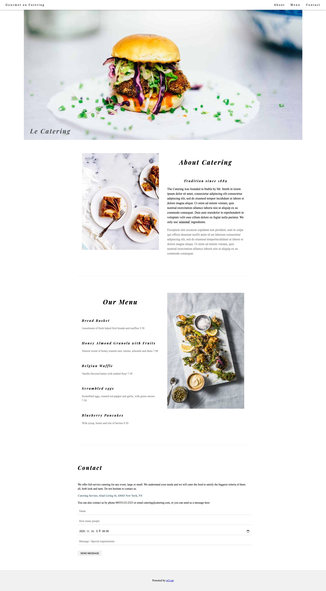
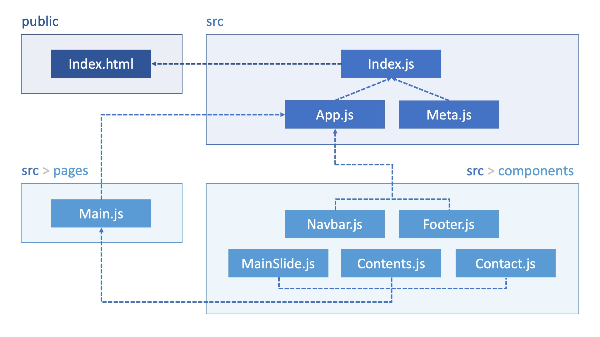

# 리액트 클론코딩 1 | 이재이



# DOM 구조


# index.js
```js
/**
 * @filename: index.js
 * @description: 프로그램 시작점.
 *               전역 SEO 구성(Meta), 라우팅 범위를 설정(BrowserRouter)하고
 *               프로그램을 시작(App)한다.
 * @author: Lee Jaei (loveleej87@gmail.com)
 */

import React from 'react';
import ReactDOM from 'react-dom/client';
import { BrowserRouter } from 'react-router-dom';
import App from './App';

const root = ReactDOM.createRoot(document.getElementById('root'));
root.render(
    <React.StrictMode>
        <BrowserRouter>
            <App />
        </BrowserRouter>
    </React.StrictMode>
);
```

# App.js
```js
import React from 'react';
import styled from 'styled-components';
import Meta from './Meta';
import Navbar from './components/Navbar';
import Main from './pages/Main';
import Footer from './components/Footer';

const Container = styled.div`
    font-family: 'Times New Roman', Georgia, Serif;
    line-height: 1.5;
`;

const App = () => {
    return (
        <div>
            <Container>      
                <Meta />   
                <Navbar />
                <Main />
                <Footer />
            </Container>
        </div>
    );
};

export default App;
```

# Meta.js
```js
/**
 * @filename: Meta.js
 * @description: <head>태그 내의 SEO 처리 및 기본 참조 리소스 명시
 * @author: Lee Jaei (loveleej87@gmail.com)
 */

/** 패키지 참조 */
// 기본 참조 객체
import React from 'react';
// SEO 처리 기능 패키지
import { Helmet, HelmetProvider } from 'react-helmet-async';

/**
 * SEO 처리 컴포넌트
 * @param props
 * @returns {JSX.Element}
 */
const Meta = (props) => {
    return (
        <HelmetProvider>
            <Helmet>
                <meta charSet='utf-8' />
                {/* SEO 태그 */}
                <title>{props.title}</title>
                <meta name='description' content={props.description} />
                <meta name='keywords' content={props.keywords} />
                <meta name='author' content={props.author} />
                <meta property='og:type' content='website' />
                <meta property='og:title' content={props.title} />
                <meta property='og:description' content={props.description} />
                <meta property='og:url' content={props.url} />
            </Helmet>
        </HelmetProvider>
    );
};

/**
 * props에 대한 기본값 설정
 * @type {{keywords: string, author: string, description: string, title: string, url: string}}
 */
Meta.defaultProps = {
    title: 'React Layout Demo',
    description: 'React.js로 구현한 레이아웃 데모 페이지 입니다.',
    keywords: 'React,layout,demo',
    author: 'Jaei',
    url: window.location.href
};

export default Meta;
```

# Main.js
```js
import React from 'react';
import MainSlide from '../components/MainSlide';
import Contents from '../components/Contents';
import Contact from '../components/Contact';

const Main = () => {
    return (
        <div>
            <MainSlide />
            <Contents />
            <Contact />
        </div>
    );
};

export default Main;
```

# MainSlide.js
```js
import React from "react";
import styled from "styled-components";
import Image from "../assets/image/hamburger.jpg";

const Slide = styled.div`
    margin-left: auto;
    margin-right: auto;
    max-width: 1600px;
    min-width: 500px;
    max-height: 800px;
    position: relative;

    img {
        max-width: 100%;
        height: auto;
    }

    .text {
        position: absolute;
        padding: 0 36px;
        left: 0;
        bottom: 0;
    }

    h1 {
        font-family: "Playfair Display";
        letter-spacing: 4px;
        font-size: 36px;
        opacity: 0.6;
    }
`;

const MainSlide = () => {
    return (
        <Slide>
            
            <div className="text">
                <h1>Le Catering</h1>
            </div>
        </Slide>
    );
};

export default MainSlide;
```

# Contents.js
```js
import React from "react";
import styled from "styled-components";
import Image2 from "../assets/image/tablesetting2.jpg";
import Image3 from "../assets/image/tablesetting.jpg";

const Content2 = styled.div`
    margin-left: auto;
    margin-right: auto;
    max-width: 980px;

    .row::after,
    .row::before {
        content: "";
        display: table;
        clear: both;
    }

    .padding {
        padding-top: 64px;
        padding-bottom: 64px;
    }

    .section {
        padding: 12px 24px;
        box-sizing: border-box;
        float: left;
        width: 50%;
    }

    .image2 {
        max-width: 100%;
        height: auto;
    }

    img {
        width: ${(props) => props.width};
        height: ${(props) => props.height};
    }

    h1 {
        font-size: 36px;
        color: #000;
    }

    h3 {
        font-family: "Playfair Display";
        letter-spacing: 4px;
    }

    hr {
        border: 0;
        border-top: 1px solid #eee;
        margin: 20px 0;
    }

    .center {
        text-align: center;
        font-family: "Playfair Display";
        letter-spacing: 4px;
    }

    .catering {
        text-align: left;
        font-size: 18px;
    }

    .tag {
        display: inline-block;
        padding-left: 8px;
        padding-right: 8px;
        text-align: center;
        color: #000;
        background-color: #f1f1f1;
    }

    .color {
        color: grey;
    }
`;

const Contents = () => {
    return (
        <Content2>
            <div className="row padding">
                <div className="section">
                    
                </div>

                <div className="section">
                    <h1 className="center">About Catering</h1>
                    <br />
                    <h3 class="center">Tradition since 1889</h3>
                    <div className="catering">
                        <p>
                            The Catering was founded in blabla by Mr. Smith in
                            lorem ipsum dolor sit amet, consectetur adipiscing
                            elit consectetur adipiscing elit, sed do eiusmod
                            tempor incididunt ut labore et dolore magna aliqua.
                            Ut enim ad minim veniam, quis nostrud exercitation
                            ullamco laboris nisi ut aliquip ex ea commodo
                            consequat. Duis aute iruredolor in reprehenderit in
                            voluptate velit esse cillum dolore eu fugiat nulla
                            pariatur. We only use
                            <span class="tag"> seasonal </span>
                            ingredients.
                        </p>
                        <p class="color">
                            Excepteur sint occaecat cupidatat non proident, sunt
                            in culpa qui officia deserunt mollit anim id est
                            laborum consectetur adipiscing elit, sed do eiusmod
                            temporincididunt ut labore et dolore magna aliqua.
                            Ut enim ad minim veniam, quis nostrud exercitation
                            ullamco laboris nisi ut aliquip ex ea commodo
                            consequat.
                        </p>
                    </div>
                </div>
            </div>
            <hr />

            <div className="row padding">
                <div className="section">
                    <h1 class="center">Our Menu</h1>
                    <br />
                    <h3>Bread Basket</h3>
                    <p class="color">
                        Assortment of fresh baked fruit breads and muffins 5.50
                    </p>
                    <br />
                    <h3>Honey Almond Granola with Fruits</h3>
                    <p class="color">
                        Natural cereal of honey toasted oats, raisins, almonds
                        and dates 7.00
                    </p>
                    <br />
                    <h3>Belgian Waffle</h3>
                    <p class="color">
                        Vanilla flavored batter with malted flour 7.50
                    </p>
                    <br />
                    <h3>Scrambled eggs</h3>
                    <p class="color">
                        Scrambled eggs, roasted red papper and garlic, with
                        green onions 7.50
                    </p>
                    <br />
                    <h3>Blueberry Pancakes</h3>
                    <p class="color">
                        With syrup, butter and lots of berries 8.50
                    </p>
                </div>
                <div className="section">
                    
                </div>
            </div>
            <hr />
        </Content2>
    );
};

export default Contents;
```

# Contact.js
```js
import React from "react";
import styled from "styled-components";

const Container = styled.div`
    margin-left: auto;
    margin-right: auto;
    max-width: 980px;

    h1 {
        font-family: "Playfair Display";
        letter-spacing: 4px;
    }

    .padding {
        padding-top: 64px;
        padding-bottom: 64px;
    }

    .padding-16 {
        padding-top: 16px;
        padding-bottom: 16px;
    }

    .contact-color {
        color: #607d8b !important;
    }
    .input {
        padding: 8px;
        display: block;
        border: none;
        border-bottom: 1px solid #ccc;
        width: 100%;
        font: inherit;
        margin: 0;
    }

    .button {
        margin-top: 16px;
        margin-bottom: 16px;
        color: #000;
        background-color: #f1f1f1;
        width: auto;
        border: none;
        display: inline-block;
        padding: 8px 16px;
        vertical-align: middle;
        overflow: hidden;
        text-decoration: none;
        text-align: center;
        cursor: pointer;
        white-space: nowrap;
    }

    .button:hover {
        color: #000 !important;
        background-color: #ccc !important;
    }
`;

const Contact = () => {
    return (
        <Container>
            <div className="padding">
                <h1>Contact</h1>
                <br />
                <p>
                    We offer full-service catering for any event, large or
                    small. We understand your needs and we will cater the food
                    to satisfy the biggerst criteria of them all, both look and
                    taste. Do not hesitate to contact us.
                </p>
                <p className="contact-color">
                    <b>Catering Service, 42nd Living St, 43043 New York, NY</b>
                </p>
                <p>
                    You can also contact us by phone 00553123-2323 or email
                    catering@catering.com, or you can send us a message here:
                </p>
                <form>
                    <p>
                        <input
                            className="input padding-16"
                            type="text"
                            placeholder="Name"
                            required
                            name="Name"
                        />
                    </p>
                    <p>
                        <input
                            className="input padding-16"
                            type="number"
                            placeholder="How many people"
                            required
                            name="People"
                        />
                    </p>
                    <p>
                        <input
                            className="input padding-16"
                            type="datetime-local"
                            placeholder="Date and time"
                            required
                            name="date"
                            value="2020-11-16T20:00"
                        />
                    </p>
                    <p>
                        <input
                            className="input padding-16"
                            type="text"
                            placeholder="Message \ Special requirements"
                            required
                            name="Message"
                        />
                    </p>
                    <button className="button" type="submit">
                        SEND MESSAGE
                    </button>
                </form>
            </div>
        </Container>
    );
};

export default Contact;
```

# Footer.js
```js
import React from 'react';
import { Link } from 'react-router-dom';
import styled from 'styled-components';

const Bottom = styled.div`
    background-color: #f1f1f1;
    width: 100%;
    padding-top: 32px;
    padding-bottom: 32px;
    text-align: center;
    margin: 0;

    &.hover {
        color: #000;
        background-color: #ccc;
    }

    .hoverText:hover {
        color: green;
    }
`;

const Footer = () => {
    return (
        <Bottom>
            <p>
                Powered by&nbsp;
                <Link to='https://www.w3schools.com/w3css/default.asp' title='W3.CSS' target='_blank' class='hoverText'>w3.css</Link>
            </p>
        </Bottom>
    );
};

export default Footer;
```