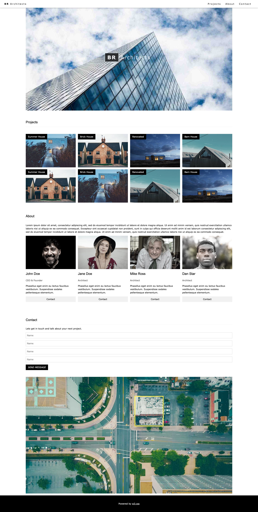
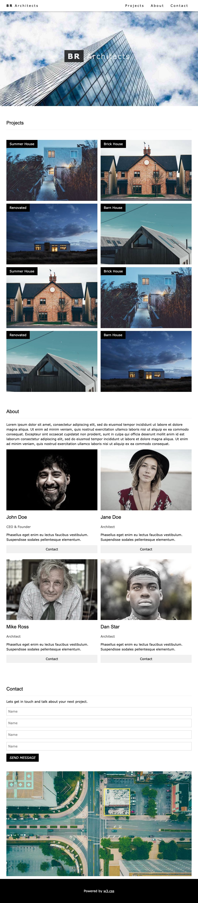
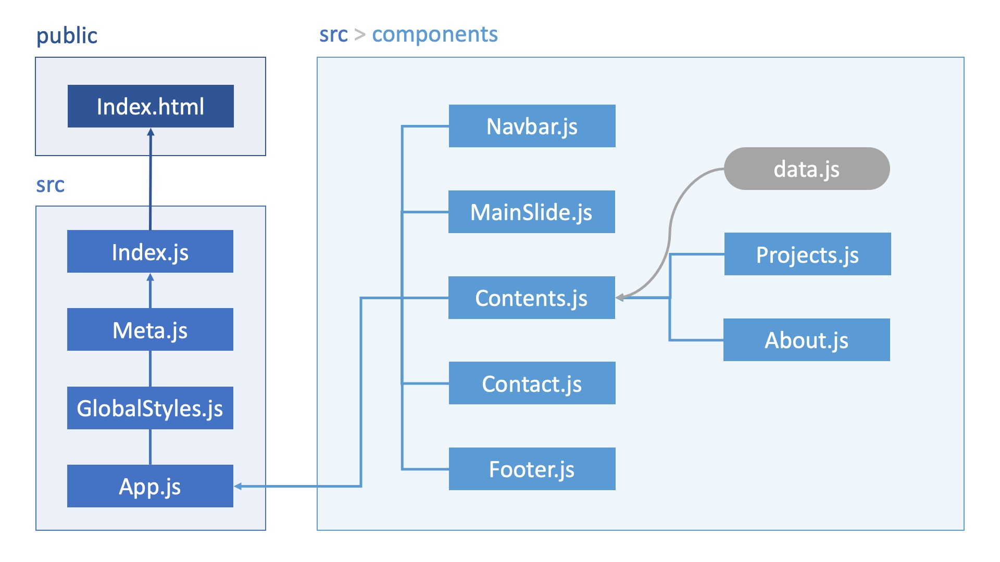

# 리액트 클론코딩 2 | 이재이

## Max-width


## Min-width


# DOM 구조


# index.js
```js
/**
 * @filename: index.js
 * @description: 프로그램 시작점.
 *               전역 SEO 구성(Meta), 라우팅 범위를 설정(BrowserRouter)하고
 *               프로그램을 시작(App)한다.
 * @author: Lee Jaei (loveleej87@gmail.com)
 */

import React from "react";
import ReactDOM from "react-dom/client";
import Meta from "./Meta";
import { BrowserRouter } from "react-router-dom";
import App from "./App";
import GlobalStyles from "./GlobalStyles";

const root = ReactDOM.createRoot(document.getElementById("root"));
root.render(
    <React.StrictMode>
        <GlobalStyles />
        <Meta />
        <BrowserRouter>
            <App />
        </BrowserRouter>
    </React.StrictMode>
);
```
# App.js
```js
/**
 * @filename: App.js
 * @description: 전체 페이지를 구성한다.
 * @author: Lee Jaei (loveleej87@gmail.com)
 */

import React from "react";

import Navbar from "./components/Navbar";
import MainSlide from "./components/MainSlide";
import Contents from "./components/Contents";
import Contact from "./components/Contact";
import Footer from "./components/Footer";

const App = () => {
    return (
        <div>
            <Navbar />
            <MainSlide />
            <Contents />
            <Contact />
            <Footer />
        </div>
    );
};

export default App;
```
# Meta.js
```js
/**
 * @filename: Meta.js
 * @description: <head>태그 내의 SEO 처리 및 기본 참조 리소스 명시
 *               기본 CSS 적용
 * @author: Lee Jaei (loveleej87@gmail.com)
 */

/** 패키지 참조 */
// 기본 참조 객체
import React from "react";
// SEO 처리 기능 패키지
import { Helmet, HelmetProvider } from "react-helmet-async";

/**
 * SEO 처리 컴포넌트
 * @param props
 * @returns {JSX.Element}
 */
const Meta = (props) => {
    return (
        <HelmetProvider>
            <Helmet>
                <meta charSet="utf-8" />
                {/* SEO 태그 */}
                <title>{props.title}</title>
                <meta name="description" content={props.description} />
                <meta name="keywords" content={props.keywords} />
                <meta name="author" content={props.author} />
                <meta property="og:type" content="website" />
                <meta property="og:title" content={props.title} />
                <meta property="og:description" content={props.description} />
                <meta property="og:url" content={props.url} />
                {/* <meta property='og:image' content={props.image} /> */}

                {/* 웹폰트 적용을 위한 외부 리소스 참조 */}
                <link rel="preconnect" href="https://fonts.googleapis.com" />
                <link
                    rel="preconnect"
                    href="https://fonts.gstatic.com"
                    crossorigin
                />
                <link href="https://fonts.googleapis.com/css?family=Karma" />

                {/* Helmet 안에서 CSS 적용하기 */}
                <style type="text/css">{`
                    html,
                    body {
                        font-family: Verdana, sans-serif;
                        font-size: 16px;
                        line-height: 1.5;
                        margin: 0;
                    }

                    h1, h2, h3, h4, h5, h6 {
                        font-family: "Segoe UI",Arial,sans-serif;
                        font-weight: 400;
                        margin: 10px 0;
                    }
                    
                    h3 {
                        font-size: 24px;
                    }

                    p {
                        display: block;
                        margin-block-start: 1em;
                        margin-block-end: 1em;
                        margin-inline-start: 0px;
                        margin-inline-end: 0px;
                      }

                    hr {
                        width: 1500px;
                        border-color: #ffffff;
                    }

                    ul, li {
                        list-style: none;
                    }

                    html {
                        box-sizing: border-box
                      }

                    *,
                    *:before,
                    *:after {
                      box-sizing: inherit;
                    }

                    p {
                        display: block;
                        margin-block-start: 1em;
                        margin-block-end: 1em;
                        margin-inline-start: 0px;
                        margin-inline-end: 0px;
                      }
                `}</style>
            </Helmet>
        </HelmetProvider>
    );
};

/**
 * props에 대한 기본값 설정
 * @type {{keywords: string, author: string, description: string, title: string, url: string}}
 */
Meta.defaultProps = {
    title: "React Layout Demo",
    description: "React.js로 구현한 레이아웃 데모 페이지 입니다.",
    keywords: "React,layout,demo",
    author: "Jaei",
    // image: '기본이미지변수적용',
    url: window.location.href,
};

export default Meta;
```
# GlobalStyles.js
```js
/**
 * @filename: GlobalStyles.js
 * @description: 전역으로 적용될 기본 스타일시트.
 *               이 파일에서 정의한 class는 ReactJSX에서 className속성으로 참조해야 한다.
 * @author: Lee Jaei (loveleej87@gmail.com)
 */

/** 패키지 참조 */
import { createGlobalStyle } from "styled-components";

/**
 * 전역 스타일 시트를 정의한 객체
 * @type {GlobalStyleComponent<{}, DefaultTheme>}
 */
const GlobalStyles = createGlobalStyle`
    * {
        font-family: Verdana, sans-serif;
    }

    body {
        margin: 0;
        padding: 0;
    }
`;

export default GlobalStyles;
```
# Navbar.js
```js
/**
 * @filename: Navbar.js
 * @description: 상단 메뉴바를 구성한다.
 * @author: Lee Jaei (loveleej87@gmail.com)
 */

import React from "react";
import styled from "styled-components";

const Top = styled.div`
    position: fixed;
    width: 100%;
    z-index: 1;
    top: 0;

    .menu {
        width: 100%;
        overflow: hidden;
        color: #000;
        background-color: #fff;
        letter-spacing: 4px;
        padding: 8px 16px;
        box-shadow: 0 2px 5px 0 rgb(0 0 0 / 16%), 0 2px 10px 0 rgb(0 0 0 / 12%);
    }

    .button {
        width: auto;
        border: none;
        display: inline-block;
        padding: 8px 16px;
        vertical-align: middle;
        overflow: hidden;
        text-decoration: none;
        color: inherit;
        background-color: inherit;
        text-align: center;
        cursor: pointer;
        white-space: nowrap;
    }

    .button:hover {
        background-color: #909090;
    }

    .nav-right {
        float: right;
        padding: 0 16px;
    }

    .text-left {
        float: left;
        padding-left: 16px;
        padding-right: 16px;
    }

    .text-right {
        float: right;
    }
`;

const Navbar = () => {
    return (
        <Top>
            <div class="menu">
                <a href="#home" class="button">
                    <b>BR</b> Architects
                </a>
                <div class="nav-right">
                    <a href="#projects" class="button">
                        Projects
                    </a>
                    <a href="#about" class="button">
                        About
                    </a>
                    <a href="#contact" class="button">
                        Contact
                    </a>
                </div>
            </div>
        </Top>
    );
};

export default Navbar;
```
# MainSlide.js
```js
/**
 * @filename: MainSlide.js
 * @description: 대문 화면을 구성한다.
 * @author: Lee Jaei (loveleej87@gmail.com)
 */

import React from "react";
import styled from "styled-components";
import Architect from "../assets/img/architect.jpg";

const Container = styled.div`
    position: relative;
    margin-left: auto;
    margin-right: auto;
    max-width: 1500px;

    img {
        vertical-align: middle;
        border-style: none;
        max-width: 100%;
        height: auto;
    }

    .fontArea {
        position: absolute;
        top: 50%;
        left: 50%;
        margin-top: 16px;
        transform: translate(-50%, -50%);
        text-align: center;
        vertical-align: middle;
    }

    .title {
        color: #fff;
        font-size: 36px;
        letter-spacing: 4px;
    }

    .title1 {
        opacity: 0.75;
        padding: 8px 16px;
        text-align: center;
        background-color: #000;
        padding: 8px 16px;
    }

    .title2 {
        opacity: 0.75;
        padding: 8px 16px;
    }
`;

const MainSlide = () => {
    return (
        <Container id="home">
            
            <div className="fontArea">
                <h1 className="title">
                    <span className="title1">
                        <b>BR</b>
                    </span>
                    <span className="title2">Architects</span>
                </h1>
            </div>
        </Container>
    );
};

export default MainSlide;
```
# Contents.js
```js
/**
 * @filename: Contents.js
 * @description: data.js에서 데이터를 바로 가져와 Projects.js 및 About.js를 구성한다.
 * @author: Lee Jaei (loveleej87@gmail.com)
 */

import React from 'react';
import styled from "styled-components";

import data from '../data';
import Projects from './Projects';
import About from './About';


const ContentsContainer = styled.div`
    padding: 8px 16px;
    max-width: 1564px;
    margin-left: auto;
    margin-right: auto;

    h3 {
        color: #000;
        padding-top: 16px;
        padding-bottom: 16px;
        border-bottom: 1px solid #eee;
    }
`;

const Contents = () => {
    return (
        <ContentsContainer>
            <Projects data={data.project} />
            <About data={data.about} />
        </ContentsContainer>
    );
};

export default Contents;
```
# Projects.js
```js
/**
 * @filename: Projects.js
 * @description: Projects 섹션을 구성하고, max-width와 min-width에 따라 컨텐츠의 크기가 변경된다.
 * @author: Lee Jaei (loveleej87@gmail.com)
 */

import React from "react";
import styled from "styled-components";

const ProjectsContainer = styled.div`
    div#project {
        padding: 0.01em 16px;
        padding-top: 32px;
        padding-bottom: 32px;
    }

    ul {
        display: flex;
        justify-content: space-evenly;
        flex-wrap: wrap;
        margin: 0;
        padding: 8px;

        li {
            @media (min-width: 601px) {
                width: 49.99999%;
            }

            @media (min-width: 993px) {
                width: 24.99999%;
            }
        }

        div {
            position: relative;
            padding-bottom: 10px;
            padding: 0 8px;
            margin-bottom: 8px;

            p {
                position: absolute;
                color: #fff;
                background-color: #000;
                width: fit-content;
                padding: 8px 16px;
                margin: 0;
            }

            img {
                width: 100%;
            }
        }
    }
`;

const Projects = (props) => {
    return (
        <ProjectsContainer>
            <div id="project">
                <h3>Projects</h3>
            </div>
            <ul>
                {props.data.map((v, i) => {
                    return (
                        <li>
                            <div>
                                <p>{v.subject}</p>
                                
                            </div>
                        </li>
                    );
                })}
            </ul>
        </ProjectsContainer>
    );
};

export default Projects;
```
# About.js
```js
/**
 * @filename: About.js
 * @description: About 섹션을 구성하고, max-width와 min-width에 따라 컨텐츠의 크기가 변경된다.
 * @author: Lee Jaei (loveleej87@gmail.com)
 */

import React from "react";
import styled from "styled-components";
import { Link } from "react-router-dom";

const AboutContainer = styled.div`
    div#about {
        padding: 0.01em 16px;
        padding-top: 32px;
    }
    
    .opacity {
        opacity: 0.75;
    }

    p {
        color: #000;
        width: fit-content;
        padding: 8px 16px;
        margin: 0;
    }

    ul {
        display: flex;
        justify-content: space-evenly;
        flex-wrap: wrap;
        margin: 0;
        padding: 8px;

        li {
            @media (min-width: 601px) {
                width: 49.99999%;
            }

            @media (min-width: 993px) {
                width: 24.99999%;
            }

            padding: 0 8px;
            padding-bottom: 16px;
            margin-bottom: 8px;
        }
            img {
                width: 100%;
                filter: grayscale(70%);
            }

            h2 {
                padding-bottom: 8px;
            }

            p {
                padding: 0;
                padding-bottom: 16px;
            }
        }

    .button {
        border: none;
        width: 100%;
        padding: 8px 16px;
        overflow: hidden;
        text-decoration: none;
        text-align: center;
        cursor: pointer;
        color: #000;
        background-color: #f1f1f1;
        font: inherit;
        user-select: none;
        -webkit-appearance: button;

        &:hover {
            background-color: #999999;
        }
    }
`;

const About = (props) => {
    return (
        <AboutContainer>
            <div id="about">
                <h3>About</h3>
            </div>
            <p>{props.data.content}</p>
            <ul>
                {props.data.member.map((v, i) => {
                    return (
                        <li>
                            
                            <h2>{v.name}</h2>
                            <p className="opacity">{v.position}</p>
                            <p>{v.desc}</p>
                            <Link to="#" className="button">
                                Contact
                            </Link>
                        </li>
                    );
                })}
            </ul>
        </AboutContainer>
    );
};

export default About;
```
# Contact.js
```js
/**
 * @filename: Contact.js
 * @description: Contact 섹션을 구성한다.
 * @author: Lee Jaei (loveleej87@gmail.com)
 */

import React from "react";
import styled from "styled-components";
import MapImg from "../assets/img/map.jpg";

const ContactContainer = styled.div`
    padding: 8px 16px;
    max-width: 1564px;
    margin-left: auto;
    margin-right: auto;

    .map {
            padding: 0.01em 16px;
            margin-left: auto;
            margin-right: auto;

            img {
                width: 100%;
            }
        }

    div#contact {
        padding: 0.01em 16px;
        padding-top: 32px;
        padding-bottom: 32px;

        h3 {
            color: #000;
            padding-top: 16px;
            padding-bottom: 16px;
            border-bottom: 1px solid #eee;
        }

        input {
            padding: 8px;
            display: block;
            width: 100%;
            overflow: visible;
            font: inherit;
            border: 1px solid #ccc;
        }

        input:nth-child(n + 1):nth-child(-n + 3) {
            margin-top: 16px;
            margin-bottom: 16px;
        }

        .sendbutton {
            border: none;
            padding: 8px 16px;
            overflow: hidden;
            text-decoration: none;
            text-align: center;
            cursor: pointer;
            white-space: nowrap;
            text-transform: none;
            font: inherit;
            user-select: none;
            margin-top: 16px !important;
            margin-bottom: 16px !important;
            color: #fff;
            background-color: #000;
        }
    }
`;

const Contact = () => {
    return (
        <ContactContainer>
            <div id="contact">
                <h3>Contact</h3>
                <p>Lets get in touch and talk about your next project.</p>
                <form action="/action_page.php" target="_blank">
                    <input
                        type="text"
                        placeholder="Name"
                        required
                        name="Name"
                    />
                    <input
                        type="text"
                        placeholder="Name"
                        required
                        name="Name"
                    />
                    <input
                        type="text"
                        placeholder="Name"
                        required
                        name="Name"
                    />
                    <input
                        type="text"
                        placeholder="Name"
                        required
                        name="Name"
                    />
                    <button className="sendbutton" type="submit">
                        <i>SEND MESSAGE</i>
                    </button>
                </form>
            </div>
            <div className="map">
                
            </div>

        </ContactContainer>
    );
};

export default Contact;
```
# Footer.js
```js
/**
 * @filename: Footer.js
 * @description: Footer 섹션을 구성한다.
 * @author: Lee Jaei (loveleej87@gmail.com)
 */

import React from "react";
import { Link } from 'react-router-dom';
import styled from "styled-components";

const Bottom = styled.div`
    color: #fff;
    background-color: #000;
    width: 100%;
    padding-top: 32px;
    padding-bottom: 32px;
    text-align: center;

    .hovertext,
    .hovertext:visited  {
        color: #fff;
    }

    .hovertext:hover {
        color: green;
    }
`;

const Footer = () => {
    return (
        <Bottom>
            <p>
            Powered by&nbsp;
                <Link to='https://www.w3schools.com/w3css/default.asp' title='W3.CSS' target='_blank' class='hovertext'>w3.css
                </Link>
            </p>
        </Bottom>
    );
};

export default Footer;
```